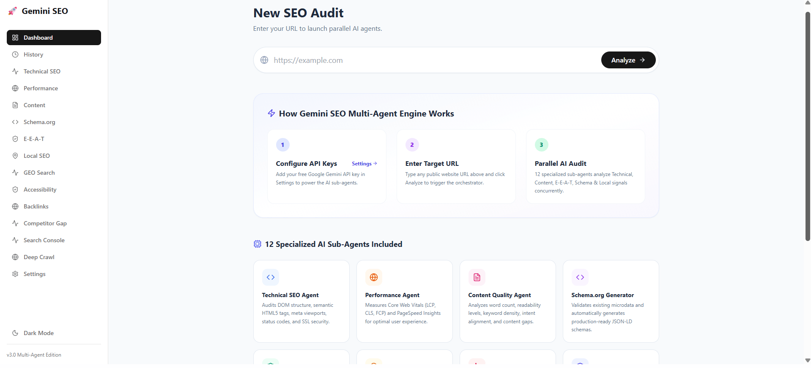
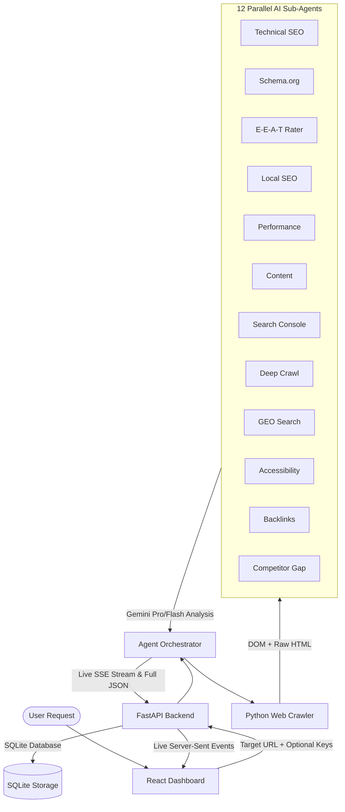

# 🚀 Gemini SEO & GEO Multi-Agent Engine

[](https://opensource.org/licenses/MIT)
[](https://www.python.org/downloads/)
[](https://reactjs.org/)
[](https://ai.google.dev/)

An advanced, open-source **Multi-Agent SEO & Generative Engine Optimization (GEO) Platform** powered by Google Gemini.

Unlike traditional monolithic SEO analyzers, **Gemini SEO Engine** spawns **12 specialized AI sub-agents in parallel**. It analyzes everything from Technical Web Vitals and E-E-A-T signals to Deep Structure crawling, GEO Search, Accessibility, Backlink Authority, and Competitor Gaps in real-time.

---

## 📸 Dashboard Overview



---

## ✨ Features (The 12-Agent System)

1. ⚡ **Parallel Multi-Agent Architecture**: Executes specialized AI agents concurrently via Python `asyncio` for blistering speed and API Rate-Limit bypass techniques.
2. 🛠️ **Technical SEO Agent**: Identifies DOM flaws, viewport issues, SSL errors, and structural hierarchy problems.
3. 🏷️ **Schema.org Agent**: Detects existing JSON-LD microdata and automatically generates validated, production-ready JSON-LD schemas.
4. 🎯 **Google E-E-A-T Agent**: Evaluates Experience, Expertise, Authoritativeness, and Trustworthiness using Google's Quality Rater guidelines.
5. 📍 **Local SEO Agent**: Scans for Name/Address/Phone (NAP) consistency, embedded Google Maps, and local search signals.
6. ⏱️ **Performance Agent (Lighthouse)**: Analyzes Core Web Vitals (LCP, FCP, CLS, TTI) via Google PageSpeed Insights API.
7. ✍️ **Content & Readability Agent**: Evaluates content quality, reading level, NLP sentiment, and keyword density.
8. 📈 **Google Search Console Agent**: Integrates OAuth JSON to fetch real clicks, impressions, and CTR for your target URL.
9. 🕸️ **Deep Crawl Agent (Firecrawl)**: Automatically crawls the entire site to discover all pages and map internal structures.
10. 🌍 **GEO Search Agent**: Analyzes how well your site answers long-form AI queries to optimize for Generative Engine Optimization (AIO/SGE).
11. ♿ **Accessibility Agent (a11y)**: Checks for WCAG compliance, ARIA attributes, contrast ratios, and screen-reader readiness.
12. 🔗 **Backlinks & Authority Agent**: Uses OpenPageRank to determine the site's Domain Authority and Backlink profile.
13. ⚔️ **Competitor Gap Agent**: Autonomously searches DuckDuckGo for top ranking competitors, crawls their sites, and runs an AI Gap Analysis!

### 🛡️ Enterprise-Grade Error Handling

- **Graceful Fallbacks**: Handles third-party API downtimes seamlessly. If a free API (like OpenPageRank) times out, the system alerts the user cleanly without crashing the pipeline.
- **Smart Rate-Limit Evasion**: Bypasses the Gemini 15 RPM Free Tier limit by dynamically batching requests and injecting intelligent `asyncio.sleep` staggers. 
- **Anti-Bot Circumvention**: If a competitor site uses Cloudflare/WAF to block bots (e.g. `403 Forbidden`), the Competitor Agent gracefully skips and iterates through the top 10 search results to find a crawlable source.
- **Client-Side Security**: Plug-and-play UI with client-side API key management via `localStorage`—no hardcoded backend credentials required!

---

## 🏗️ Multi-Agent System Architecture



---

## 🚀 Quick Start

### 1. Prerequisites

- Python 3.10+
- Node.js 18+
- Google Gemini API Key ([Get one free here](https://aistudio.google.com/))
- *(Optional)* Google Cloud API Key (for PageSpeed / Lighthouse API)
- *(Optional)* Firecrawl API Key
- *(Optional)* OpenPageRank API Key

### 2. Run with Docker (Recommended)

```bash
git clone https://github.com/navidseyedain/gemini-seo.git
cd gemini-seo

# Copy environment template
cp .env.example .env

# Run all services
docker-compose up --build
```
Open your browser at `http://localhost:5173`.

### 3. Manual Setup (Alternative)

**Backend Setup:**
```bash
git clone https://github.com/navidseyedain/gemini-seo.git
cd gemini-seo
python -m venv .venv
source .venv/bin/activate  # On Windows: .venv\Scripts\activate
pip install -r requirements.txt
cp .env.example .env
uvicorn api:app --reload --port 8005
```

**Frontend Setup:**
```bash
# Open a new terminal tab
cd frontend
npm install
npm run dev
```

Open your browser at `http://localhost:5173`, navigate to **Settings**, paste your **Gemini API Key**, and launch your first multi-agent audit!

---

## 🛠️ Built With

- **Backend**: FastAPI, Google GenAI SDK, BeautifulSoup4, SQLAlchemy, httpx, DuckDuckGo Search, Pydantic v2
- **Frontend**: React, Vite, Tailwind CSS, Lucide Icons, Framer Motion, Recharts
- **Database**: SQLite
- **Infrastructure**: Docker Compose, Server-Sent Events (SSE)

---

## 🤝 Contributing

Contributions are what make the open-source community such an amazing place to learn, inspire, and create. Any contributions you make are **greatly appreciated**. Please read `CONTRIBUTING.md` for guidelines.

## 📜 License

Distributed under the MIT License. See `LICENSE` for more information.

---
⭐ **If you find this multi-agent SEO platform useful, please give it a star on GitHub to support the project!**
